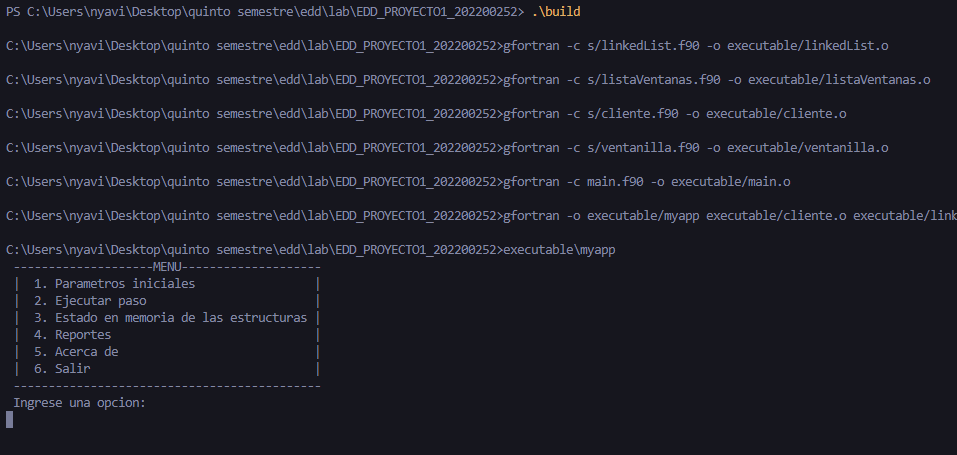

#Manual de usuario
##Menú

El menú cuenta con las siguientes funciones:
- **Parámetros iniciales:** En esta sección se le daran los siguientes parametros al programa para la simulación.
    - Carga masiva de clientes: Aquí se le cargarán los clientes iniciales al programa a travez de un archivo .json
    - Cantidad de ventanillas: Aquí se le indicará al programa la cantidad de ventanillas disponibles.
- **Ejecutar pasos:** En esta sección se ejecutaran los pasos para ver a detalle la simulación.
- **Estado de memoria de las estructuras:** 
- **Reporte:** En esta seccion se mostrarán las estructuras implementadas con la herramienta Graphviz. Ademas de los siguientes datos generales:
    - Top 5 de clientes con mayor cantidad de imágenes grandes.
    - Top 5 de clientes con menor cantidad de imágenes pequeñas.
    - Información del cliente que más pasos estuvo en el sistema.
    - Datos de un cliente en específico, se debe incluir la información del cliente, así como
el detalle de todas las imágenes entregadas para impresión

##Estructura del archivo .JSON
```
[
    {
        "id": "1",
        "nombre": "Andres Lopez",
        "img_g": "3",
        "img_p": "2"
    },
    {
        "id": "2",
        "nombre": "Juan Perez",
        "img_g": "3",
        "img_p": "0"
    },
    {
        "id": "3",
        "nombre": "Luiz Higueros",
        "img_g": "2",
        "img_p": "1"
    }
]
```

##Objetos
Este código define un módulo llamado `cliente`. En este módulo, se define un tipo de datos llamado `Clientes`, que tiene cuatro componentes: un entero llamado `id`, una cadena de caracteres de longitud variable llamada `nombre`, y dos enteros más llamados `img_g` y `img_p`.

Dentro del módulo, hay una subrutina llamada `Cinicializar`, que inicializa los valores de un objeto del tipo `Clientes`. Toma como argumentos un objeto del tipo `Clientes` (denotado como `self`), y cuatro valores: `id`, `nombre`, `img_g` e `img_p`. Estos valores se asignan a los componentes del objeto `Clientes` que se pasa como argumento a la subrutina. La subrutina utiliza la palabra clave `intent` para especificar si los argumentos se utilizarán para entrada, salida o ambas. En este caso, `intent(inout)` se usa para indicar que `self` es tanto una entrada como una salida, mientras que los otros argumentos son entradas.

En resumen, este módulo y su subrutina proporcionan una estructura básica para representar clientes con identificadores, nombres y valores de imagen tanto grandes (`img_g`) como pequeños (`img_p`). La subrutina `Cinicializar` se utiliza para asignar valores a un objeto de cliente.
```
module cliente
    implicit none 

    type:: Clientes
        integer:: id
        character(len=:), allocatable:: nombre
        integer:: img_g
        integer:: img_p
    end type Clientes
 
    contains

    subroutine Cinicializar(self, id, nombre, img_g, img_p)
        class(Clientes), intent(inout):: self
        integer, intent(in):: id, img_g, img_p
        character(len=*), intent(in):: nombre

        self%id = id
        self%nombre = nombre
        self%img_g = img_g
        self%img_p = img_p 
    end subroutine Cinicializar 

end module cliente

!Instanciar y declarar:

type(Clientes):: nuevoCliente 
call Cinicializar(nuevoCliente, 1, "Nestor Villatoro", 3, 2)
call mylist%push(nuevoCliente)
```

##Lista enlazada
Este código define un módulo llamado `linkedList`. En este módulo, se definen dos tipos de datos: `linked_list` y `node`. 

El tipo `linked_list` representa una lista enlazada y tiene un único componente llamado `head`, que es un puntero a un objeto del tipo `node`. Además, tiene tres subrutinas asociadas: `push`, `print` y `verificarElementos`.

El tipo `node` representa un nodo en la lista enlazada y tiene dos componentes: `value`, que es un objeto del tipo `Clientes`, y `next`, que es un puntero a otro objeto del tipo `node`.

La subrutina `push` añade un nuevo nodo a la lista enlazada. Toma como argumento un objeto del tipo `Clientes` y lo agrega como el valor del nodo recién creado. Luego, conecta este nodo con el resto de la lista enlazada.

La subrutina `print` imprime los valores de todos los nodos de la lista enlazada, mostrando los detalles del cliente almacenado en cada nodo, como el ID, nombre, img_g y img_p.

La subrutina `verificarElementos` verifica si la lista enlazada contiene elementos o está vacía. Toma un argumento lógico `verificarEstado` y lo establece como verdadero si la lista tiene al menos un nodo, y falso si está vacía.

En resumen, este módulo proporciona una estructura para manejar una lista enlazada de clientes, permitiendo agregar nuevos clientes, imprimir los detalles de todos los clientes en la lista y verificar si la lista está vacía o no.
```
module linkedList
  use cliente 
  implicit none

  type :: linked_list
    type(node), pointer :: head => null() ! head of the list

    contains
      procedure :: push
      procedure :: print
      procedure :: verificarElementos
  end type linked_list

  type :: node
    type(Clientes) :: value
    type(node), pointer :: next
  end type node

  contains

  subroutine push(self, value)
    class(linked_list), intent(inout) :: self
    type(Clientes), intent(in) :: value

    type(node), pointer :: newNode
    allocate(newNode)

    newNode%value = value
    newNode%next => null()

    if (.not. associated(self%head)) then
      self%head => newNode
    else
      newNode%next => self%head
      self%head => newNode
    end if

    print *, 'pushed:: ', value%nombre
  end subroutine push

  subroutine print(self)
    class(linked_list), intent(in) :: self

    type(node), pointer :: current

    current => self%head

    do while (associated(current))
      print *, "ID: ", current%value%id 
      print*, "Nombre: ", current%value%nombre
      print*, "img_g: ", current%value%img_g
      print*, "img_p: ", current%value%img_p
      current => current%next
    end do
  end subroutine print

  subroutine verificarElementos(self, verificarEstado)
    class(linked_list), intent(inout) :: self
    logical::verificarEstado
    if (.not. associated(self%head)) then
      verificarEstado = .false.
    else
      verificarEstado = .true.
    end if
    end subroutine verificarElementos
    
end module linkedList

!Agregar objetos a la lista:

type(linked_list):: mylist
type(Clientes):: nuevoCliente 
call Cinicializar(nuevoCliente, 1, "Nestor Villatoro", 3, 2)
call mylist%push(nuevoCliente)
```