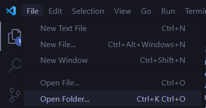
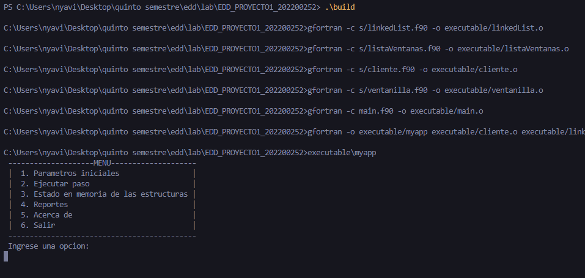

#Manual técnico
##Requisitos:
Para correr el programa se requiere un espacio libre de 2mb ademas de tener instalado Fortran, Cmake y poseer un programa donde correr la aplicacíon como el Visual Studio Code.
##Instalación del programa:
Para la instalación del programa solo se debe descargar la carpeta y en el editor de código arrastrarla o abrirla como proyecto desde file - open folder. A continuacion se mostrará un ejemplo:

Nos dirigimos a File y luego a Open File

Seleccionamso el folder del proyecto

Abrimos la terminal con el atajo ctrl+ñ y escribimos .\build
Se mostrará el menú del programa de la siguiente forma:

Con estos pasos ya se tendría el programa instalado y listo para usarse.    